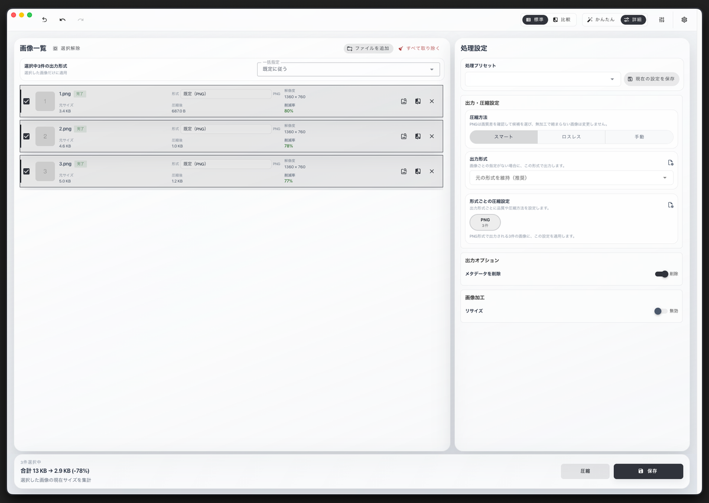
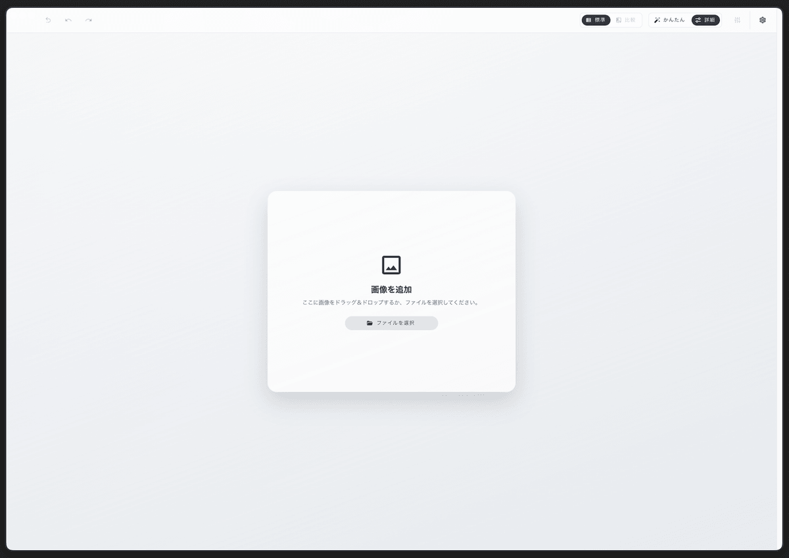
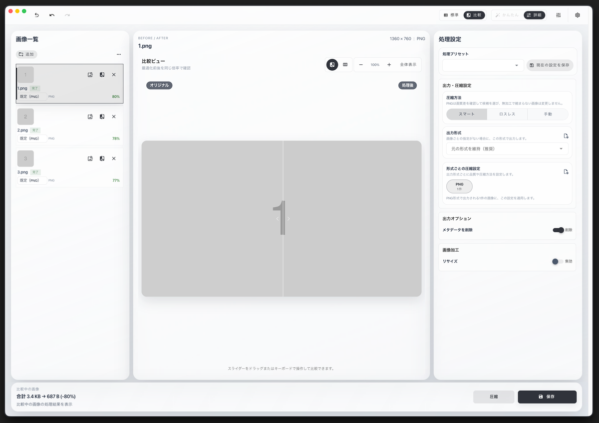
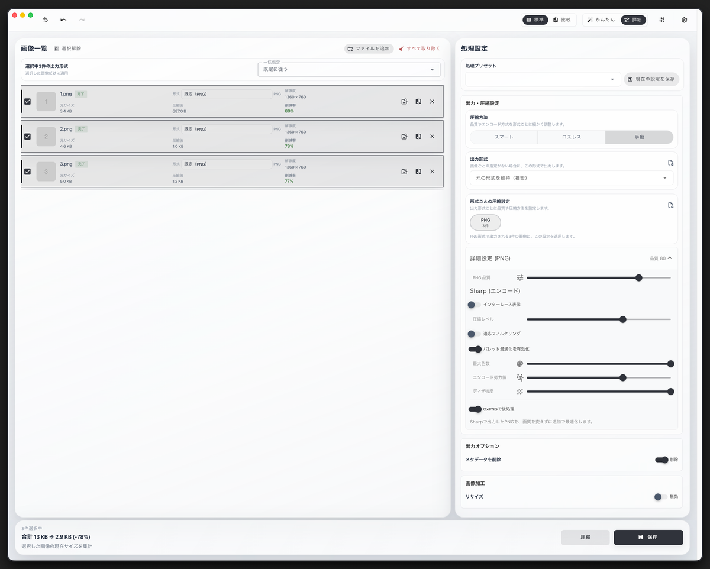
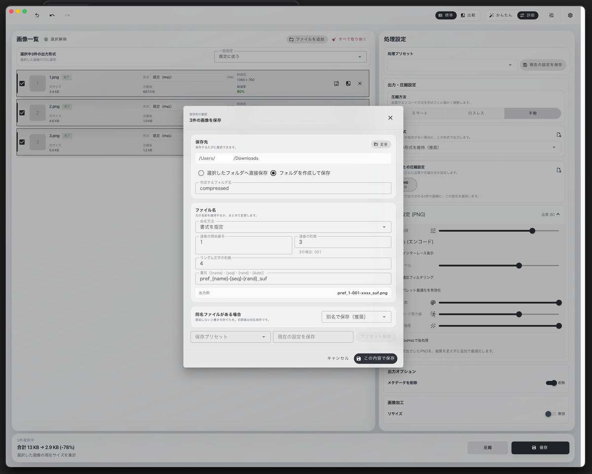

# MountPixel

MountPixelは、画像の圧縮、形式変換、比較、保存をデスクトップ上で完結できる画像ユーティリティです。

JPEG、PNG、WebP、AVIFに対応し、複数の画像をまとめて処理できます。
読み込んだ画像は端末内で処理され、画像処理のために外部サーバーへ送信されません。

> [!NOTE]
> 現在は正式公開前のベータ版です。
> 重要な画像は元ファイルを残した状態で利用してください。

## スクリーンショット

### 圧縮・変換設定

複数の画像を一覧で確認しながら、出力形式や圧縮方法をまとめて設定できます。

### 画像の追加

画像はドラッグ＆ドロップ、またはファイル選択から追加できます。

### 処理前後の比較

オリジナルと処理後の画像を並べ、見た目とファイルサイズの変化を確認できます。

### 詳細な圧縮設定

画像形式に応じた品質や圧縮方式を細かく調整できます。

### 保存設定

保存先、ファイル名、連番などを保存前にまとめて設定できます。

## ダウンロード

最新版は[GitHub Releases](https://github.com/yama-dev/mount-pixel/releases/latest)からダウンロードできます。

- **macOS**：Apple Silicon（arm64）対応。Developer IDによる署名とAppleの公証に対応
- **Windows**：x64対応。ベータ版は未署名

Windows版では、初回起動時にMicrosoft Defender SmartScreenの警告が表示される場合があります。
配布元とファイル名を確認し、「詳細情報」から実行してください。

## 主な機能

- 複数画像の一括読み込み、圧縮、保存
- JPEG、PNG、WebP、AVIFへの形式変換
- 画像ごとの出力形式指定
- 形式ごとの品質と圧縮方式の詳細設定
- PNGのスマート圧縮とOxiPNGによるロスレス後処理
- リサイズとメタデータ削除
- 処理前後の比較プレビュー
- 処理プリセットと保存プリセットの保存、共有
- 連番、ランダム文字列、テンプレートによるリネーム
- 保存先、ファイル名、競合時の動作を確認できる保存画面
- ダーク／ライトテーマと表示スタイル
- アプリ内アップデート

## 対応形式

| 形式 | 読み込み | 出力 |
| --- | :---: | :---: |
| JPEG | ✓ | ✓ |
| PNG | ✓ | ✓ |
| WebP | ✓ | ✓ |
| AVIF | ✓ | ✓ |

TIFF、GIF、アニメーション画像には対応していません。

## プライバシー

画像の読み込み、圧縮、形式変換、比較、保存は端末内で実行されます。
アップデートの確認とダウンロードではGitHub Releasesへ接続します。

## 開発状況

MountPixelは現在、正式公開に向けて社内ベータ検証を進めています。
不具合を報告する際は、OS、アプリのバージョン、画像形式、再現手順を添えてください。

Copyright © yama-dev
